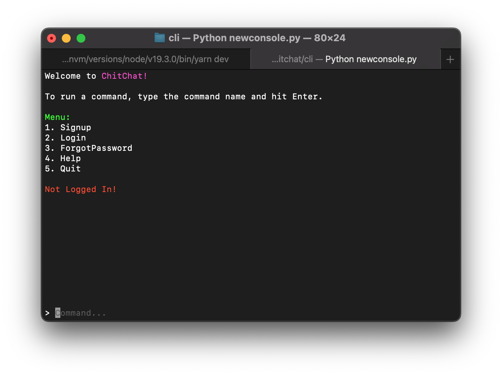

# CHIT-CHAT
Chitchat is a command line chatting software that can be used by developers to communicate with each other.
Apart from being a regular chatting tool, it also provides other interesting features like ranking system for developers, a search tool for searching other developers of a certain tech stack and so many others.
Chitchat hopes to add a little bit of social life to many developers who prefer to be labelled ‘introverts’ by bringing a means of communication to a terminal.


## INSTALLATION
- Clone the project repository from github into your local computer
- Download the neccessary packages in the requirement.txt file
- Navigate into the cli directory
run ``` python3 -m chitchat ```

## TECHNOLOGIES USED
Mongodb is used to store the required data
Express js was also used to set up the necessary APIs
The console which is the client interface was written in python

## IMAGES



## AUTHORS
Akinwonjowo Dennis [Github](https://github.com/Dennisco12) / [LinkedIn](https://www.linkedin.com/in/dennis-akinwonjowo)</br>
Benjamin Eruvieru [Github](https://github.com/benjamineruvieru) / [LinkedIn](https://www.linkedin.com/in/benjamineruvieru) / [Email](benjamineruvieru@gmail.com)</br>
Nnaemeka Joseph [Github](https://github.com/nnaemekaxi) / [LinkedIn](https://www.linkedin.com/in/nnaemeka11/)</br>
